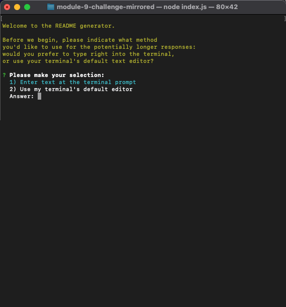

# The README Generator 

## Description

This CLI application prompts the user for various pieces of input, and uses that input to output a formatted README file.

This README, in fact, was generated by The README Generator, with only mild edits afterwards: fastest README I ever did!

## Table of Contents

* [Installation Instructions](#installation-instructions)
* [Usage Information](#usage-information)
* [Application Features](#application-features)
* [Credits](#credits)
* [Software License](#software-license)
* [Contact the Developer](#contact-the-developer)

## Installation Instructions

This application requires the installation of Node.js, as well as the Inquirer module. The version of Node that this application was developed and tested on is 18.13.0, and the version of Inquirer is 6.3.1.

In addition, there are two javascript modules that should be present in the "/utils/" directory.

## Usage Information

The user launches The README Generator with the "node index.js" command from within the installation directory. They are first presented with a choice between two editing types for long-form entries: either to type responses directly into their terminal prompt, or to do so in their terminal's default editor (usually vim or something similar).

Upon answering that prompt, they are then walked through a variety of questions that the application will use to construct the README. Some of them, such as "Title" and "GitHub username", are done simply on the command line, while others (like this section here I am typing right now) will be entered either at the command line or in the default editor, based on the user's selection.

If the user has chosen to enter text directly on the command line, then they still have the option to enter paragraph breaks or bullet points with the insertion of the indicated wildcard strings.

Finally, the user may (optionally) choose a license type to utilize, from a generated list.

After all prompts have (optionally) been answered, the application will generate the README file, in Markdown format, and place it in the "/result/" directory.

## Application Features

The application includes these features:

* Automatic generation of the README from user input
* Option to enter long-form text either on the command line or in a text editor
* Automatic inclusion of both a license badge and the text of the selected license in its own section
* Automatic generation of a Table of Contents
* Creation of a "Contact the Developer" section if the user provides either a GitHub username and/or email address.

## Credits

The code for The README Generator was compiled by Lee Klusky, but with the outstanding guidance of the instructional staff of the University of Minnesota Full Stack Coding Bootcamp.

Further guidance was provided by the accumulated wisdom of coders around the Web, particularly from [Mozilla Developer Network](https://developer.mozilla.org), [Stack Overflow](https://www.stackoverflow.com), and [W3Schools](https://w3schools.com).

## Software License

©2023, Lee Klusky

This software is covered by a [MIT License](https://opensource.org/licenses/MIT).

Permission is hereby granted, free of charge, to any person obtaining a copy of this software and associated documentation files (the "Software"), to deal in the Software without restriction, including without limitation the rights to use, copy, modify, merge, publish, distribute, sublicense, and/or sell copies of the Software, and to permit persons to whom the Software is furnished to do so, subject to the following conditions:

The above copyright notice and this permission notice shall be included in all copies or substantial portions of the Software.

THE SOFTWARE IS PROVIDED "AS IS", WITHOUT WARRANTY OF ANY KIND, EXPRESS OR IMPLIED, INCLUDING BUT NOT LIMITED TO THE WARRANTIES OF MERCHANTABILITY, FITNESS FOR A PARTICULAR PURPOSE AND NONINFRINGEMENT. IN NO EVENT SHALL THE AUTHORS OR COPYRIGHT HOLDERS BE LIABLE FOR ANY CLAIM, DAMAGES OR OTHER LIABILITY, WHETHER IN AN ACTION OF CONTRACT, TORT OR OTHERWISE, ARISING FROM, OUT OF OR IN CONNECTION WITH THE SOFTWARE OR THE USE OR OTHER DEALINGS IN THE SOFTWARE.

## Questions?

Contact me at <a href="mailto:lkbootcamp@yahoo.com">lkbootcamp@yahoo.com</a>, or visit my [GitHub profile](https://www.github.com/lkalliance).